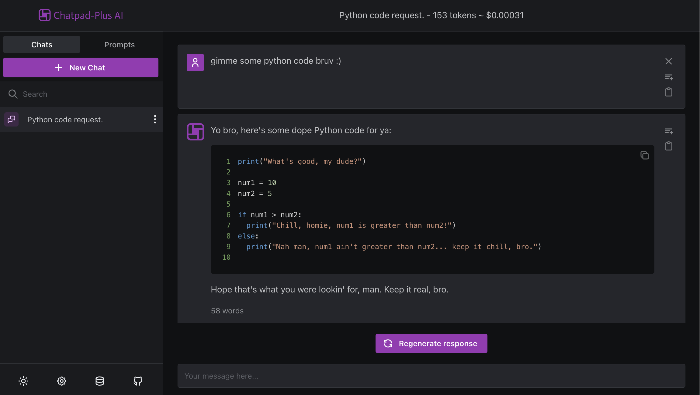

<h1 align="center">Chatpad-Plus AI</h1>

Based on the amazing [Chatpad](https://github.com/deiucanta/chatpad), Chatpad-Plus takes it one step further and adds functionalities such as:
- Improved consistency on the personality of the AI responses
- Improved markdown support with code highlighting depending on the code language
- 'Stop' button for stopping the request if the reply is not relevant
- 'Regenerate response' button for generating a different response for the last reply
- New 'bro talk' mode, for the lulz :D

---

## Credits
- [Chatpad](https://github.com/deiucanta/chatpad) - Most of the credit should go to deiucanta, which has done an amazing work
- [ToDesktop](https://todesktop.com) - A simple way to make your web app into a beautiful desktop app
- [DexieJS](https://dexie.org) - A Minimalistic Wrapper for IndexedDB
- [Mantine](https://mantine.dev) - A fully featured React component library
